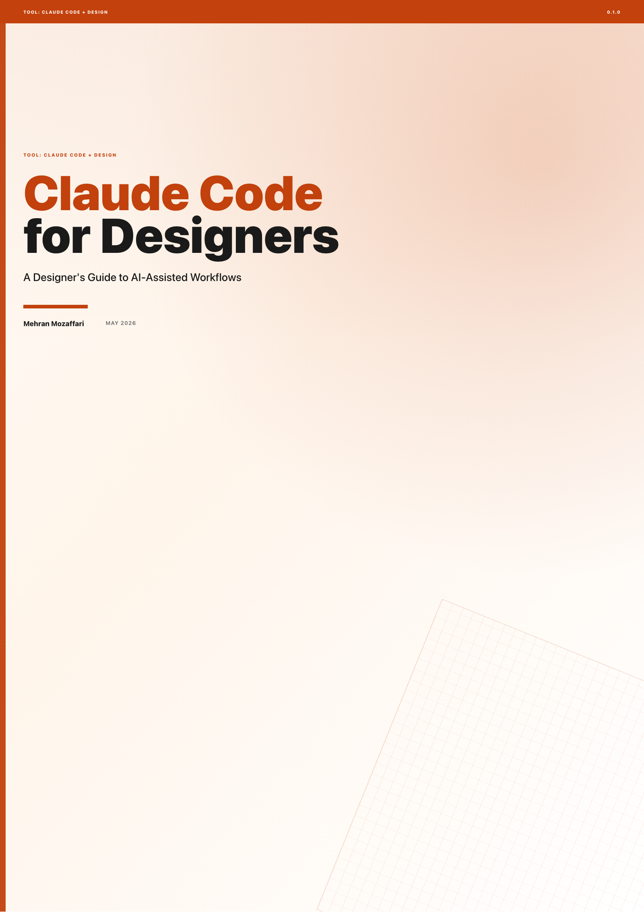

# Claude Code for Designers

> A Designer's Guide to AI-Assisted Workflows · by Mehran Mozaffari

Full breadth: Claude Code installation and setup, core concepts for non-developers, turning design ideas into working prototypes, generating and refining visual design, writing production frontend code, maintaining design systems, automating repetitive design tasks, collaborating with engineers using AI, real-world case studies, and future of AI-assisted design workflows

## Download

| Format | File |
|--------|------|
| Paged HTML Preview | [claude-code-for-designers-paged.html](claude-code-for-designers-paged.html) |
| ePub | [claude-code-for-designers.epub](claude-code-for-designers.epub) |
| HTML | [claude-code-for-designers.html](claude-code-for-designers.html) |
| PDF | [claude-code-for-designers.pdf](claude-code-for-designers.pdf) |

## What This Book Covers

Full breadth: Claude Code installation and setup, core concepts for non-developers, turning design ideas into working prototypes, generating and refining visual design, writing production frontend code, maintaining design systems, automating repetitive design tasks, collaborating with engineers using AI, real-world case studies, and future of AI-assisted design workflows

14 chapters are included in this release.

## Who Is This For

product designers (UX/UI) who want to prototype, build, and automate design work using AI-powered coding tools

## Repository Contents

| Path | Purpose |
|------|---------|
| `README.md` | Public landing page for the book repository |
| `CHANGELOG.md` | Version-by-version release notes |
| `LICENSE.md` | Book license |
| `cover.png` / `banner.png` | Public book artwork when available |
| `assets/` | Public supporting assets |
| `screenshots/` | Public screenshots used by the book |
| `*.pdf` / `*.epub` / `*.html` | Published book artifacts |

## About the Author

Mehran Mozaffari

## Credits

| Role | Credit |
|------|--------|
| Author | Mehran Mozaffari |
| Editorial review | Multi-model AI review pipeline |
| Technical reviewers | Claude Opus 4.6, Gemini 3.1 Pro |
| Design and production | Agentic publishing pipeline (OpenCode) |

## Contact the Author

- Blog: [https://piazr.github.io/applied-ai/](https://piazr.github.io/applied-ai/)
- GitHub: [https://github.com/imehr](https://github.com/imehr)

For corrections, errata, or licensing inquiries, please open an issue on this repository or contact the author through the channels above.

## Version

- **v0.1.0** — May 2026
- AI tools evolve rapidly; check the official project documentation for current product behavior.

## License

[CC BY-NC-SA 4.0](https://creativecommons.org/licenses/by-nc-sa/4.0/) — free to share and adapt with attribution, non-commercial use only, under the same license.
