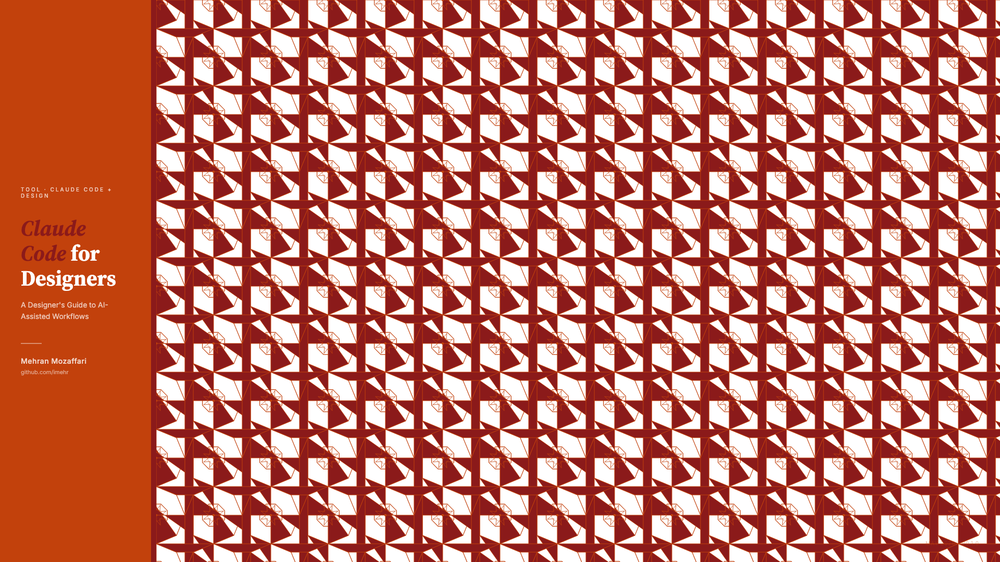

# Claude Code for Designers

> A designer's guide to AI-assisted workflows — from setup and basics through prototyping, visual design, production UI code, design system maintenance, and team collaboration.

**Author:** [Mehran Mozaffari](https://github.com/imehr)
**Version:** 1.0.0
**Date:** May 2026
**Pages:** 60
**Words:** ~38,000

## About

This book is for product designers (UX/UI) who want to prototype, build, and automate design work using AI-powered coding tools. It covers Claude Code (Anthropic's CLI coding agent) from installation and basics through prototyping, visual design, production frontend code, design system maintenance, and team collaboration.

---

## Front Cover

---

## Table of Contents

- **Letter:** Why I Wrote This Book for Designers
- **Chapter 1:** The Design-Code Gap
- **Chapter 2:** Getting Started (No Terminal Fear Required)
- **Chapter 3:** Your First Design Prototype
- **Chapter 4:** The Art of Prompting for Design
- **Chapter 5:** Teaching Claude Your Design Language
- **Chapter 6:** Design Systems at Scale
- **Chapter 7:** Automating Design Workflows
- **Chapter 8:** Connecting Your Design Tools
- **Chapter 9:** From Design to Production
- **Chapter 10:** The AI Design Tool Landscape
- **Appendix A:** Claude Code Command Reference for Designers
- **Appendix B:** Pricing, Plans, and Limits
- **Appendix C:** Troubleshooting and FAQ

---

## Downloads

| Format | File | Size |
|--------|------|------|
| PDF | [book.pdf](book.pdf) | 870 KB |
| ePub | [book.epub](book.epub) | 110 KB |
| HTML | [Web Version](web/) | — |

---

## Changelog

### v1.0.0 — May 2026

- Initial release
- 10 chapters + 1 letter + 3 appendices
- 60 pages, ~35,000 words
- 40+ annotated screenshots
- Islamic geometric cover art

## License

This work is licensed under a Personal Use License. Free for personal, non-commercial use. Commercial use, redistribution for profit, and team/business use require written permission.

See [LICENSE](LICENSE) for full terms. For commercial licensing, contact [Mehran Mozaffari](https://github.com/imehr).
